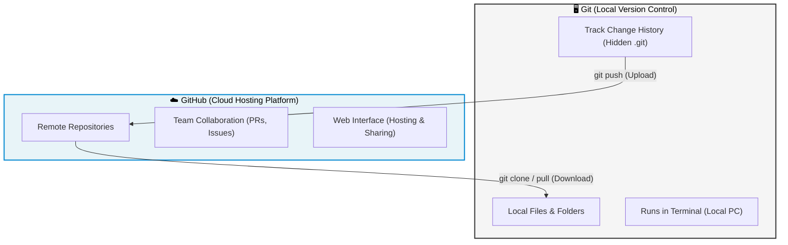
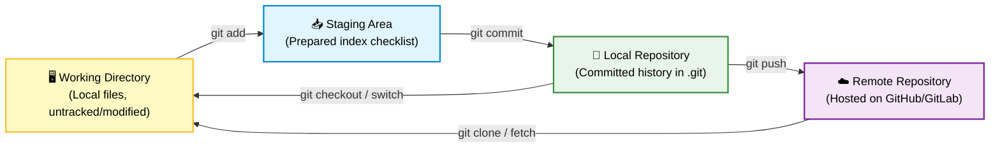

# Module 1: Introduction & Core Concepts

---

## 1.1 What is Git?

**Git** is a powerful **version control system (VCS)** that constantly tracks every change you make to your files — day or night, 365 days a year.

Git records:
- **What** changed (which lines were edited)
- **When** it changed (timestamp)
- **Who** changed it (author)
- **Where** it happened (which file/directory)

### What kind of files can Git track?

Almost **any kind** — not just code:

| File Type | Examples |
|-----------|----------|
| Code | JavaScript, Python, PHP, Java, C++ |
| Text | `.txt`, `.md`, `.csv`, `.json` |
| Images | `.png`, `.jpg`, `.svg` |
| Config | `.yml`, `.env`, `.xml` |
| Documents | `.html`, `.css` |

> **Key Insight:** Git is most commonly used in coding projects, but its power goes far beyond just code.

---

## 1.2 What is Version Control?

Version control is the practice of **tracking and managing changes** to files over time.

### Why do we need it?

Imagine this real-world scenario:

| Day | What Happens |
|-----|-------------|
| **Day 1** | You write code → Client loves it ✅ |
| **Day 30** | Client requests changes → You update the code ✅ |
| **Day 35** | Client says "Actually, the OLD version was better" 😰 |

**Without Git:** You've already overwritten the original. The old version is **gone forever**.

**With Git:** Every version is safely stored. You can **roll back** to any previous state in seconds.

> **This is why Git is called a Version Control System** — it keeps every version of your files safely stored so you can go back to any previous state whenever you need to.

### Key capabilities:
- ✅ Save **multiple versions** of the same file
- ✅ **Roll back** to any previous version instantly
- ✅ Never lose a file or accidentally overwrite something important
- ✅ Track the complete **history** of every change

---

## 1.3 A Brief History

Git was created by **Linus Torvalds** — the same brilliant mind behind **Linux**.

> *"Most tools we programmers use have a short lifespan, but Git is one of those rare ones that once you learn it, stays useful for the rest of your career."*

Git is:
- **Simple** — built around a few core commands and concepts
- **Powerful** — handles projects of any size
- **Universal** — used by virtually every software team in the world

---

## 1.4 Git vs. GitHub

This is one of the most important distinctions to understand:

> ☕ **Git** is the coffee.  
> 🏪 **GitHub** is the coffee shop where that coffee is served.

They are **connected** but **completely different**.

| Feature | Git | GitHub |
|---------|-----|--------|
| **What is it?** | A version control tool | A cloud hosting platform |
| **Where does it run?** | Locally on your computer | On the internet (cloud) |
| **Purpose** | Track changes to files | Share, collaborate, and back up code |
| **Created by** | Linus Torvalds | Chris Wanstrath, Tom Preston-Werner |
| **Owned by** | Open-source community | Microsoft |
| **Alternatives** | Mercurial, SVN | GitLab, Bitbucket |
| **Visual State** | Offline tracking | Online storage and UI |

### Other platforms similar to GitHub:
- **GitLab** — widely used, offers CI/CD pipelines
- **Bitbucket** — popular with Atlassian (Jira) users

> **GitHub remains the most popular and widely adopted platform**, now owned by Microsoft with a strong focus on the open-source community.

---

## 1.5 Git Architecture: Local vs. Remote

Git is divided into **two major parts**:

- 🖥️ **Local (Your Computer)** — where you do all your work
- ☁️ **Remote (The Cloud)** — where you push/upload your work (usually GitHub)

### The Four Stages of Git

### Explanation of each stage:

| Stage | What happens | Analogy |
|-------|-------------|---------|
| **Working Directory** | You write code, create/modify files | Your desk where you work |
| **Staging Area** | You mark changes as "ready" | A checklist before packing a suitcase |
| **Local Repository** | You permanently save (commit) changes | Locking the suitcase |
| **Remote Repository** | You upload to the cloud (push) | Shipping the suitcase to storage |

### Detailed Step-by-Step Architecture Flow:

| Step | Command | Stage Shift | Local Status | Git Internal Functionality |
|------|---------|-------------|--------------|----------------------------|
| **1. Create / Edit Files** | *(Manual edit)* | Working Directory | Files are **Untracked** or **Modified** locally | Changes exist only in memory or transient files on disk. Git does not record history yet. |
| **2. Stage Changes** | `git add <file>` | Working Directory ➔ Staging Area | Files are **Staged** (ready to commit) | Git creates a **Blob object** containing the file content, compresses it, and updates the `index` binary file in `.git/`. |
| **3. Commit Staged Files** | `git commit -m "msg"` | Staging Area ➔ Local Repository | Files are **Committed** to local history | Git creates a **Tree object** (representing directory state) and a **Commit object** (meta-data: author, parent link, tree hash) inside `.git/objects/`. Moves the local branch reference (e.g. `main`) to this new commit. |
| **4. Push to Cloud** | `git push origin <branch>` | Local Repository ➔ Remote Repository | Local commits match Remote state | Git negotiates with the remote server, packs the new objects, uploads them via SSH/HTTPS, and updates the remote-tracking ref (e.g., `origin/main`). |

> **Think of GitHub like Google Drive for code** — you *could* keep everything only on your device, but you store it in the cloud so you can access it from anywhere. Even if something gets deleted locally, it stays safe online.

### What is a Repository?

A **repository** (or "repo") is a place where all the versions of your files and their complete change history are stored.

- **Local repository** — a specific folder on your own computer (contains a hidden `.git` folder)
- **Remote repository** — lives on a cloud server like GitHub

> Think of a repository as a **digital cabinet for your code** — a secure place where Git neatly stores every record of your work.

Inside the repository, Git automatically creates system files that track:
- Your changes
- History
- Commits
- Branch information
- And more

These files are managed **entirely by Git itself**.

---

## 📝 Key Takeaways

1. **Git** = local version control tool; **GitHub** = cloud hosting platform
2. Git tracks **what, when, who, and where** for every change
3. Version control means **never losing** a previous version of your work
4. Git architecture flows: **Working Directory → Staging Area → Local Repo → Remote Repo**
5. A repository is where Git stores all versions and history of your project

---

[← Back to Index](../README.md) | [Next: Setup & Initialization →](02_setup_and_init.md)
