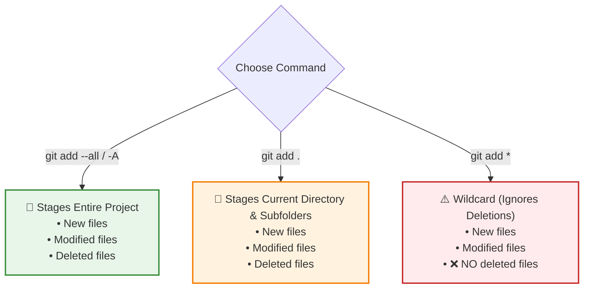
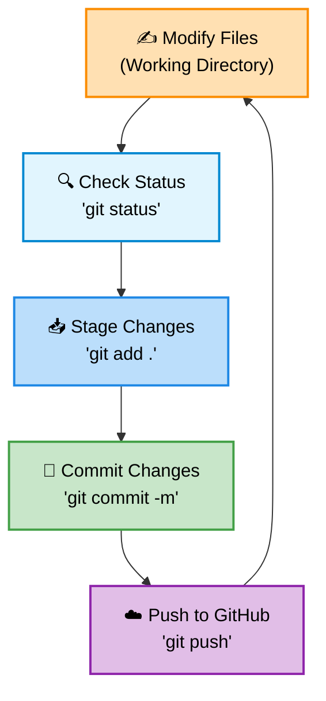

# Module 3: Basic Git Workflow

---

## 3.1 `git status` — Tracking Changes

The `git status` command shows you the **current state** of your working directory and staging area.

```bash
git status
```

### What it tells you:

| Status | Meaning |
|--------|---------|
| **modified** | An existing tracked file has been changed |
| **new file** | A brand-new file that Git hasn't seen before |
| **deleted** | A tracked file that has been removed |
| **untracked** | A file/folder that Git isn't monitoring yet |

### Example output:

```
On branch main
Changes not staged for commit:
  (use "git add <file>..." to update what will be committed)
        modified:   1.txt
        modified:   2.txt

Untracked files:
  (use "git add <file>..." to include in what will be committed)
        my-folder/
```

> **Why are some files "tracked" and some "untracked"?**
> - Files that came from a cloned repo or have been previously committed are **tracked** — Git already knows about them
> - Newly created files are **untracked** — Git doesn't recognize them yet until you `git add` them

### Best Practice:
Run `git status` **frequently** — before adding, before committing, after resetting. It's your dashboard for understanding what's going on.

---

## 3.2 `git add` — Staging Changes

The `git add` command moves changes from the **Working Directory** to the **Staging Area**.

> **Staging** = telling Git: *"I want to keep this change."*

### Why not commit directly?

Think of it like **getting ready for a party**:
1. You stand in front of a mirror (Working Directory)
2. You check your clothes and adjust them (Staging Area)
3. Once everything looks perfect, you leave for the party (Commit)

The staging area is an **intermediate step** where you review and prepare changes before permanently saving them.

---

### All Variations of `git add`



#### 1. `git add --all` (or `git add -A`)

**Stages EVERYTHING** across the entire project — new, modified, AND deleted files.

```bash
git add --all
# OR
git add -A
```

> These two commands do **exactly the same thing**. Use whichever you prefer.

---

#### 2. `git add .` (dot)

Stages all changes **in the current directory and its subdirectories**.

```bash
# From the root folder — stages everything (same as --all)
git add .

# From inside a subfolder — stages ONLY changes in that subfolder
cd my-folder
git add .    # Only stages files inside my-folder/
```

> **Key difference:** `--all` and `-A` always stage the entire project. The `.` (dot) stages only the **current directory** and everything inside it.

---

#### 3. `git add *` (star/wildcard)

Stages **new and modified** files, but **NOT deleted** files.

```bash
git add *
```

> ⚠️ **Important:** If you deleted a file, `git add *` will NOT stage that deletion. Use `git add .` or `git add --all` instead.

---

#### 4. `git add <filename>` — Stage a specific file

```bash
git add 1.txt
git add my-folder/3.txt
```

---

#### 5. `git add *.extension` — Stage by file type

```bash
git add *.txt    # Stages all .txt files in the current directory
git add *.js     # Stages all .js files in the current directory
```

> **Note:** This only stages files in the root/current folder. It won't include files inside subfolders, and it won't stage deleted files.

---

## 3.3 `git reset` — Unstaging Files

If you've staged changes but want to **undo** the staging (move them back to the working directory):

```bash
git reset
```

This **unstages everything** but keeps your actual file changes intact.

**Output:**
```
Unstaged changes after reset:
M    1.txt
M    2.txt
```

> `git reset` is safe — it only removes files from the staging area. Your actual file contents remain unchanged.

---

## 3.4 `git commit` — Saving Changes Permanently

Once your changes are staged, you **commit** them to permanently save them in the local repository.

```bash
git commit -m "Your commit message here"
```

### The `-m` flag

The `-m` flag lets you add a **short message** describing what you changed. This message becomes part of the project's history.

### Example:

```bash
git commit -m "Added user authentication feature"
```

**Output:**
```
[main abc1234] Added user authentication feature
 3 files changed, 45 insertions(+), 2 deletions(-)
```

### What makes a good commit message?

| ✅ Good Messages | ❌ Bad Messages |
|-----------------|----------------|
| "Add login page with form validation" | "stuff" |
| "Fix bug in payment calculation" | "changes" |
| "Update README with setup instructions" | "updated files" |
| "Remove deprecated API endpoints" | "fixed" |

> **Tip:** Write commit messages in the **imperative mood** (like giving a command): "Add feature" not "Added feature".

---

## 3.5 `git reset HEAD~` — Undoing the Last Commit

If you want to **undo your last commit** and bring everything back to the working directory:

```bash
git reset HEAD~
```

This:
- ✅ Undoes the commit
- ✅ Moves changes back to the working directory (unstaged)
- ✅ Keeps all your file changes intact

> You can then modify files and commit them again.

### `git reset --hard`

If you want to undo the commit AND **discard all changes** (restore files to their previous state):

```bash
git reset --hard
```

> ⚠️ **Warning:** `--hard` permanently discards your changes. Use with caution!

### Comparison:

| Command | Undo commit | Keep changes | Restore deleted files |
|---------|-------------|-------------|----------------------|
| `git reset` | ✅ | ✅ (unstaged) | ❌ |
| `git reset HEAD~` | ✅ | ✅ (unstaged) | ❌ |
| `git reset --hard` | ✅ | ❌ (discarded) | ✅ |

---

## 3.6 `git rm` — Deleting Files

### Basic usage: Delete and stage in one step

Instead of manually deleting a file and then running `git add`, you can do both at once:

```bash
git rm 4.txt
```

This:
- Deletes the file from your file system
- Stages the deletion automatically

---

### `git rm -f` — Force delete

If a file has **uncommitted local changes**, Git won't let you delete it (to protect your work). To force deletion:

```bash
git rm -f 4.txt
```

> ⚠️ This **forcefully deletes** the file even if it has unsaved changes.

---

### `git rm --cached` — Stop tracking without deleting

Removes the file from Git's tracking (staging area) but **keeps the actual file** on your disk:

```bash
git rm --cached 4.txt
```

After running this:
- The file moves to the **untracked** section
- The file itself **still exists** in your working directory
- Git will no longer track changes to it

> **Use case:** You accidentally committed a file you didn't want tracked (like a `.env` file or `node_modules/`).

---

### `git rm -r <folder>` — Recursively delete a folder

The `-r` flag stands for **recursive**. It deletes the folder and **everything inside it**:

```bash
git rm -r my-folder
```

This removes `my-folder/` and all its contents, and stages the deletion automatically.

> Without `-r`, Git won't delete a folder that contains files.

---

### Summary of `git rm` flags:

| Command | Deletes file? | Stages deletion? | Notes |
|---------|--------------|-------------------|-------|
| `git rm <file>` | ✅ | ✅ | Standard delete + stage |
| `git rm -f <file>` | ✅ | ✅ | Force delete (even with local changes) |
| `git rm --cached <file>` | ❌ | ✅ | Untrack file, keep on disk |
| `git rm -r <folder>` | ✅ | ✅ | Recursive delete (folder + contents) |

---

## 3.7 `git log` — Viewing Commit History

### Basic log:

```bash
git log
```

Shows the **full commit history** with details:
- **Commit ID** (a long hash like `a1b2c3d4e5f6...`)
- **Author** name and email
- **Date** of the commit
- **Commit message**

### Compact log:

```bash
git log --oneline
```

Shows a **shortened, clean summary** — one line per commit:

```
a1b2c3d (HEAD -> main) Added user authentication
e4f5g6h Updated README
i7j8k9l Initial commit
```

> The shortened commit IDs can also be used to reference specific commits.

---

## 3.8 The Complete Daily Workflow



### Detailed Step-by-Step Daily Workflow with Git Statuses & Internals:

Assume we edit `1.txt` inside our repo. Here is how the states shift at each step:

#### Step 1: Check what changed
* **Command:** `git status`
* **Local State / File Status:** `1.txt` is displayed under "Changes not staged for commit" (in Red).
* **Git Internal Action:** Git compares the SHA-1 hashes of the current files on disk with the checksums recorded in the binary `index` cache file. Since they differ, Git flags the file as **Modified**.

#### Step 2: Stage the changes
* **Command:** `git add .`
* **Local State / File Status:** `1.txt` is moved to the "Staging Area" (displayed in Green under "Changes to be committed").
* **Git Internal Action:** Git compresses the modified contents of `1.txt` and writes it as a new **blob object** inside `.git/objects/`. It then updates the binary `.git/index` file with this blob's unique SHA-1 hash.

#### Step 3: Save the changes locally
* **Command:** `git commit -m "Updated 1.txt message"`
* **Local State / File Status:** Working directory is **Clean**. The local branch HEAD points to the new commit.
* **Git Internal Action:** Git packages the staging index layout into a **tree object** representing the folder structure. It then creates a **commit object** pointing to this tree hash, the parent commit's SHA-1 hash, the author details, and the commit message. Finally, Git updates the active branch reference pointer file (e.g. `.git/refs/heads/main`) to point to the new commit object's SHA-1.

#### Step 4: Upload changes to GitHub
* **Command:** `git push`
* **Local State / File Status:** Local commits match Remote state. Local branch `main` and remote tracking branch `origin/main` align.
* **Git Internal Action:** Git reads the commits starting from the remote pointer up to the local pointer, compiles all reference objects into a single compressed pack file, transfers it over HTTP/SSH, and updates the remote server's branch pointer.

#### Step 5: Verify the log history
* **Command:** `git log --oneline`
* **Local State / File Status:** Prints current history timeline list.
* **Git Internal Action:** Git traverses backward from the commit pointed to by `HEAD`, following each commit object's parent pointer, and prints the short hash and description.

---

## 📝 Key Takeaways

1. **`git status`** — your dashboard; check it often
2. **`git add .`** — the simplest way to stage everything from the root directory
3. **`git add --all`** and **`git add -A`** — identical; stage everything project-wide
4. **`git add *`** — stages new/modified but NOT deleted files
5. **`git commit -m`** — permanently saves staged changes with a descriptive message
6. **`git reset`** — unstages changes; `--hard` discards them entirely
7. **`git rm`** — deletes + stages in one step; use `--cached` to keep the file
8. **`git log --oneline`** — clean, compact commit history

---

[← Previous: Setup & Init](02_setup_and_init.md) | [Back to Index](../README.md) | [Next: Branching & Merging →](04_branching_merging.md)
