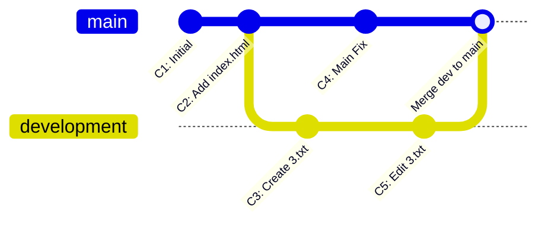

# Module 4: Branching & Merging

---

## 4.1 What is a Branch?

A **branch** in Git is a **separate line of development** where you can work independently without affecting the main project.

### The Restaurant Kitchen Analogy 🍳

> Imagine you are working in the kitchen of a large restaurant:
> - The **main branch** is the **main kitchen** where all dishes are prepared and served to customers
> - If you want to try a **new recipe**, you wouldn't experiment in the main kitchen — that could ruin everything
> - Instead, you create a **separate test kitchen** to safely prepare and taste the new dish
> - Once the recipe is **perfected**, you bring it back into the main kitchen

Git branching works **exactly the same way**:
- Don't make experimental changes directly on `main`
- Create a separate branch, test your changes there
- Once everything works, merge it back into `main`

---

## 4.2 The `main` Branch

Every Git repository starts with a **default branch**:

- It used to be called `master`
- In recent times, Git has shifted to calling it **`main`**
- The idea remains the same — it's your project's **central line of development**

---

## 4.3 `git branch` — Creating & Listing Branches

### List all branches:

```bash
git branch
```

**Output:**
```
* main
```

The `*` indicates which branch you're currently on.

### Create a new branch:

```bash
git branch development
```

Now check again:
```bash
git branch
```

**Output:**
```
  development
* main
```

> **Important:** When you create a new branch, it **inherits the exact state** of the branch you were on at that moment. It's an exact copy.

---

## 4.4 `git checkout` — Switching Branches

### Switch to an existing branch:

```bash
git checkout development
```

**Output:**
```
Switched to branch 'development'
```

### Modern alternative — `git switch`:

```bash
git switch development
```

> `git switch` was introduced in Git 2.23 as a cleaner alternative to `git checkout` for switching branches. Both work the same way.

### Create and switch in one command:

```bash
git checkout -b feature-login
# OR
git switch -c feature-login
```

This creates the branch AND switches to it immediately.

---

## 4.5 How Branching Works in Practice



### Detailed Step-by-Step Branching Practice with Statuses & Internals:

| Step | Command | Active Branch | Working Directory File State | Git Internal Mechanics |
|------|---------|---------------|------------------------------|------------------------|
| **1** | `git checkout main` | `main` | `1.txt`, `2.txt` | Git reads the HEAD file and sets its value to point to `refs/heads/main`. It updates the index and working directory to match the commit that `main` points to. |
| **2** | `git checkout -b development` | `development` | `1.txt`, `2.txt` | Git creates a new pointer file `.git/refs/heads/development` with the same commit SHA-1 hash as `main`, then updates `.git/HEAD` to point to this new branch file. |
| **3** | `touch 3.txt`<br>`git add .`<br>`git commit -m "Add 3.txt"` | `development` | `1.txt`, `2.txt`, `3.txt` | The staging index and objects database are updated. A new commit object is created, and the `development` branch pointer is updated to point to it. The `main` branch pointer remains unchanged. |
| **4** | `git checkout main` | `main` | `1.txt`, `2.txt` | Git updates `.git/HEAD` to point to `refs/heads/main`. It notes that the commit `main` points to does not contain `3.txt`. It safely deletes `3.txt` from the working directory on your disk. |
| **5** | `ls` | `main` | `1.txt`, `2.txt` (No `3.txt`) | The OS lists the directory. Since Git removed `3.txt` during checkout, it is invisible in this branch's workspace. |

> Git has **complete control** over your file system. When you switch branches, Git instantly adjusts which files are visible so you only see changes relevant to that branch.

### Key rules:
- Changes must be **committed** to belong to a branch
- Uncommitted changes will **follow you** when switching branches (which can cause confusion)
- Each branch has its own **isolated view** of the project

---

## 4.6 `git merge` — Combining Branches

**Merge** means combining the changes from one branch into another.

### How to merge:

**Always switch to the branch you want to merge INTO**, then run `git merge`:

```bash
# Step 1: Switch to the destination branch (e.g., main)
git checkout main

# Step 2: Merge the source branch into it
git merge development
```

### Example workflow:

```bash
# Currently on development branch, switch to main
git checkout main

# Merge development into main
git merge development
```

**Output:**
```
Updating abc1234..def5678
Fast-forward
 3.txt | 1 +
 1 file changed, 1 insertion(+)
 create mode 100644 3.txt
```

Now `3.txt` exists on `main` too!

---

## 4.7 Types of Merges

### 1. Fast-Forward Merge

When the branch you're merging into hasn't changed since the branch was created. Git simply moves the pointer forward. No merge commit is needed — Git just "fast-forwards" the main branch.

### 2. Three-Way Merge (Merge Commit)

When **both branches** have new commits. Git creates a special **merge commit** that combines both histories together.

---

## 4.8 Merge Conflicts

### What is a merge conflict?

A conflict happens when **two branches modify the same line(s)** in the same file and Git can't decide which version to keep.

### When does it happen?

| Branch | Line 5 Content |
|--------|---------------|
| **main** | `Hello World` |
| **development** | `Hello Git` |

Git doesn't know which one is correct, so it asks YOU to resolve it.

### What does a conflict look like?

When a conflict occurs, Git marks the conflicting areas in the file:

```
<<<<<<< HEAD
Hello World
=======
Hello Git
>>>>>>> development
```

| Marker | Meaning |
|--------|---------|
| `<<<<<<< HEAD` | Start of YOUR branch's version (current branch) |
| `=======` | Separator between the two versions |
| `>>>>>>> development` | End of the INCOMING branch's version |

### How to resolve a merge conflict:

**Step 1:** Open the conflicted file in your editor

**Step 2:** Choose which version to keep (or combine both):

```
Hello Git World
```

**Step 3:** Remove ALL conflict markers (`<<<<<<<`, `=======`, `>>>>>>>`)

**Step 4:** Stage and commit the resolved file:

```bash
git add .
git commit -m "Resolved merge conflict in greeting.txt"
```

### Tips for avoiding conflicts:
- Pull from remote **frequently** to stay up to date
- Work on **separate files** when possible
- Communicate with your team about who's working on what
- Use **smaller, more frequent commits** instead of large ones

---

## 4.9 Deleting a Branch

After a branch has been merged, you can safely delete it:

```bash
# Delete a local branch
git branch -d development

# Force delete (even if not merged)
git branch -D development
```

| Flag | Behavior |
|------|----------|
| `-d` | Safe delete — only if the branch has been merged |
| `-D` | Force delete — deletes regardless of merge status |

---

## 4.10 Branching Best Practices

### Common branch naming conventions:

| Branch Name | Purpose |
|-------------|---------|
| `main` | Production-ready code |
| `development` or `dev` | Active development |
| `feature/login` | New feature |
| `bugfix/payment-error` | Bug fix |
| `hotfix/security-patch` | Urgent fix for production |
| `release/v2.0` | Release preparation |

### Recommended workflow:

1. Branch off `development` for new features
2. Merge features back into `development`
3. When ready, merge `development` into `main`

---

## 📝 Key Takeaways

1. **Branches** let you work on features independently without affecting `main`
2. **`git branch <name>`** creates a new branch; **`git checkout <name>`** switches to it
3. **`git checkout -b <name>`** creates + switches in one step
4. **`git merge <branch>`** combines another branch into your current one
5. Always **switch to the destination branch** before merging
6. **Merge conflicts** happen when two branches change the same lines — resolve manually
7. Delete merged branches with `git branch -d <name>` to keep things clean

---

[← Previous: Basic Workflow](03_basic_workflow.md) | [Back to Index](../README.md) | [Next: Advanced Git →](05_advanced_git.md)
