# Module 5: Advanced Git

---

## 5.1 `git stash` — Save Work Temporarily

### What is stashing?

Sometimes you're in the middle of work but need to **switch branches urgently** — without committing your half-finished changes. That's where `git stash` comes in.

`git stash` takes your **uncommitted changes** (both staged and unstaged) and saves them on a temporary stack, giving you a clean working directory.

### The Analogy 📦

> Imagine you're painting a room and suddenly need to answer the door. You can't just leave the paint everywhere. So you quickly put the paint and brushes in a box (stash), answer the door, and then come back and take them out again.

---

### Basic stash commands:

#### Save your current changes:

```bash
git stash
```

**Output:**
```
Saved working directory and index state WIP on main: abc1234 Last commit message
```

Your working directory is now **clean** — as if you never made those changes.

#### Save with a descriptive message:

```bash
git stash save "Working on login form - not done yet"
```

---

#### Restore (pop) the most recent stash:

```bash
git stash pop
```

This:
- ✅ Restores your stashed changes to the working directory
- ✅ Removes the stash from the stack

---

#### Apply without removing from the stack:

```bash
git stash apply
```

This restores your changes but **keeps the stash** in case you need it again.

---

#### List all stashes:

```bash
git stash list
```

**Output:**
```
stash@{0}: WIP on main: abc1234 Last commit message
stash@{1}: On development: Working on login form
stash@{2}: On feature: Fixing header layout
```

---

#### Apply a specific stash:

```bash
git stash apply stash@{1}
```

---

#### Drop (delete) a specific stash:

```bash
git stash drop stash@{0}
```

---

#### Clear ALL stashes:

```bash
git stash clear
```

> ⚠️ This permanently deletes all stashes. Use with caution.

---

### Stash Summary Table:

| Command | What it does |
|---------|-------------|
| `git stash` | Save changes to stack, clean working dir |
| `git stash save "msg"` | Save with a descriptive message |
| `git stash pop` | Restore most recent stash + remove from stack |
| `git stash apply` | Restore most recent stash + keep on stack |
| `git stash list` | Show all saved stashes |
| `git stash apply stash@{n}` | Restore a specific stash |
| `git stash drop stash@{n}` | Delete a specific stash |
| `git stash clear` | Delete ALL stashes |

---

## 5.2 `git rebase` — Rewriting History

### What is rebasing?

`git rebase` is an **alternative to merge** for integrating changes from one branch into another. Instead of creating a merge commit, it **re-applies your commits on top of** the other branch.

### Merge vs. Rebase — Visual Comparison

```mermaid
graph TD
    subgraph MergeStrategy ["🔀 Git Merge Strategy"]
        MC1["Commit 1 (main)"] --> MC2["Commit 2 (main)"]
        MC2 --> MC4["Commit 4 (main)"]
        MC2 --> MC3["Commit 3 (feature)"]
        MC3 --> MC5["Commit 5 (feature)"]
        MC4 --> MC_Merge["Merge Commit (main)"]
        MC5 --> MC_Merge
    end

    subgraph RebaseStrategy ["🔁 Git Rebase Strategy"]
        RC1["Commit 1 (main)"] --> RC2["Commit 2 (main)"]
        RC2 --> RC4["Commit 4 (main)"]
        RC4 --> RC3_Prime["Commit 3' (feature - replayed)"]
        RC3_Prime --> RC5_Prime["Commit 5' (feature - replayed)"]
    end

    style MergeStrategy fill:#f9f9f9,stroke:#e91e63,stroke-width:2px,color:#000
    style RebaseStrategy fill:#f9f9f9,stroke:#009688,stroke-width:2px,color:#000
    style MC_Merge fill:#e1f5fe,stroke:#03a9f4,stroke-width:2px,color:#000
```



---

### How to rebase:

```bash
# 1. Switch to your feature branch
git checkout feature

# 2. Rebase onto main
git rebase main
```

### Detailed Step-by-Step Rebasing Walkthrough:

Assume you have a `main` branch with commits `C1 ➔ C2 ➔ C4`, and a local `feature` branch pointing to `C2` with a local commit `C3`.

| Step | Command | Active Branch | Working Directory State | HEAD & Refs Status | Git Internal Mechanics |
|------|---------|---------------|-------------------------|--------------------|------------------------|
| **1** | `git checkout feature` | `feature` | Files contain `C1 + C2 + C3` changes | `HEAD` points to `refs/heads/feature` | Git sets working directory files to match the index database state of `C3`. |
| **2** | `git rebase main` | `feature` | Files transition dynamically to main + feature | `HEAD` temporary detached | Git identifies the common ancestor (`C2`), saves the commits on the feature branch (`C3`) to a temporary area, resets `feature` branch to point to `C4` (the tip of `main`), and then replays the saved commit (`C3`) on top of `C4` as a new commit (`C3'`). |
| **3** | *(Conflict check)* | `feature` | Files are updated or marked conflicted | `HEAD` points to `C3'` | If conflicts occur, Git pauses and asks you to resolve them, then run `git rebase --continue`. If clean, Git commits the changes as `C3'` with a brand new SHA-1 hash. |

---

### When to use Merge vs. Rebase:

| Criteria | `git merge` | `git rebase` |
|----------|------------|-------------|
| **History** | Preserves exact history (merge commits) | Creates a linear, clean history |
| **Safety** | Safe for shared branches | ⚠️ Never rebase shared/public branches |
| **Complexity** | Simple | More powerful, more risk |
| **Use when** | Merging feature into main | Keeping feature branch up to date |
| **Creates merge commit?** | Yes | No |

### The Golden Rule of Rebasing:

> ⚠️ **NEVER rebase commits that have been pushed to a shared/public repository.** Only rebase your own local, unpushed commits. Rebasing rewrites commit history, which can cause serious problems for other collaborators.

---

### Interactive Rebase:

For advanced editing of commit history:

```bash
git rebase -i HEAD~3
```

This opens an editor showing your last 3 commits, letting you:

| Action | Keyword | What it does |
|--------|---------|-------------|
| Keep as-is | `pick` | Keep the commit unchanged |
| Edit message | `reword` | Change the commit message |
| Combine commits | `squash` | Merge into the previous commit |
| Remove | `drop` | Delete the commit entirely |

---

## 5.3 `git reflog` — Finding Lost Commits

### What is reflog?

`git reflog` (reference log) records **every move** your HEAD pointer makes. Even if you've "lost" a commit through a reset or rebase, reflog can help you find it.

```bash
git reflog
```

**Output:**
```
abc1234 HEAD@{0}: commit: Added new feature
def5678 HEAD@{1}: checkout: moving from development to main
ghi9012 HEAD@{2}: commit: Fixed login bug
jkl3456 HEAD@{3}: reset: moving to HEAD~2
```

### Recovering a lost commit:

```bash
# 1. Find the commit ID in reflog
git reflog

# 2. Reset to that commit
git reset --hard abc1234

# OR create a new branch pointing to the lost commit
git checkout -b recovered-branch abc1234
```

> **Reflog is your safety net.** Even if you accidentally delete commits with `git reset --hard`, they're still in the reflog for about **90 days**.

---

## 5.4 `git diff` — Viewing Changes

### See what changed (unstaged):

```bash
git diff
```

### See what's staged (ready to commit):

```bash
git diff --staged
```

### Compare two branches:

```bash
git diff main..development
```

### Compare with a specific commit:

```bash
git diff abc1234
```

### Example output:

```diff
diff --git a/1.txt b/1.txt
index abc1234..def5678 100644
--- a/1.txt
+++ b/1.txt
@@ -1 +1,2 @@
 one
+one modified
```

| Symbol | Meaning |
|--------|---------|
| `-` (red) | Line was removed |
| `+` (green) | Line was added |
| ` ` (no symbol) | Line is unchanged (context) |

---

## 5.5 `git tag` — Marking Important Points

Tags are **named references** to specific commits, commonly used for releases.

### Create a tag:

```bash
# Lightweight tag
git tag v1.0

# Annotated tag (recommended)
git tag -a v1.0 -m "Version 1.0 release"
```

### List all tags:

```bash
git tag
```

### Push tags to remote:

```bash
git push origin v1.0        # Push a specific tag
git push origin --tags       # Push all tags
```

### Delete a tag:

```bash
git tag -d v1.0              # Delete locally
git push origin --delete v1.0  # Delete from remote
```

---

## 📝 Key Takeaways

1. **`git stash`** — temporarily save uncommitted work; `pop` to restore
2. **`git rebase`** — replay commits on top of another branch for a clean linear history
3. **Never rebase** commits that have been pushed to a shared repository
4. **`git reflog`** — your safety net for finding "lost" commits (saved for ~90 days)
5. **`git diff`** — see exactly what changed, line by line
6. **`git tag`** — mark important commits (like releases) with named references

---

[← Previous: Branching & Merging](04_branching_merging.md) | [Back to Index](../README.md) | [Next: GitHub & Collaboration →](06_github_collaboration.md)
