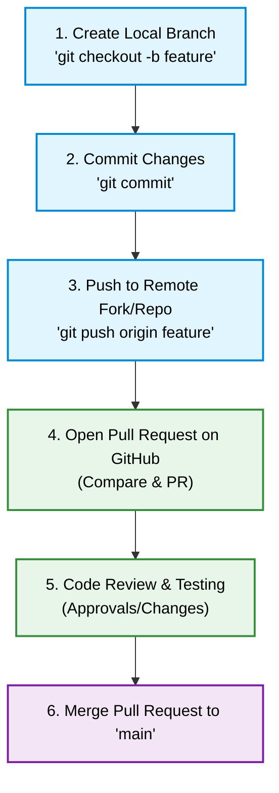

# Module 6: GitHub & Collaboration

---

## 6.1 Working with Remotes

A **remote** is a version of your repository that lives on a server (like GitHub). It enables collaboration and backup.

### View your remotes:

```bash
git remote -v
```

**Output:**
```
origin  https://github.com/username/repo.git (fetch)
origin  https://github.com/username/repo.git (push)
```

> When you clone a repository, Git automatically names the remote **`origin`**.

### Add a remote:

```bash
git remote add origin https://github.com/username/repo.git
```

### Change a remote URL:

```bash
git remote set-url origin https://github.com/username/new-repo.git
```

### Remove a remote:

```bash
git remote remove origin
```

---

## 6.2 `git push` — Uploading to Remote

Push sends your **local commits** to the remote repository.

### First push (set upstream):

```bash
git push -u origin main
```

The `-u` flag sets `origin/main` as the **upstream** (default) for future pushes.

### Subsequent pushes:

```bash
git push
```

### Push a specific branch:

```bash
git push origin development
```

### Push all branches:

```bash
git push --all origin
```

### Force push (⚠️ dangerous):

```bash
git push --force
```

> ⚠️ **Force push overwrites the remote history.** Only use when you're absolutely sure (e.g., after a rebase on a personal branch).

---

## 6.3 `git pull` — Downloading from Remote

Pull **fetches** changes from the remote AND **merges** them into your current branch.

```bash
git pull origin main
```

Or simply (if upstream is set):

```bash
git pull
```

### What `git pull` actually does:

```bash
# git pull is equivalent to:
git fetch origin    # Download changes
git merge origin/main  # Merge them into your branch
```

---

## 6.4 `git fetch` — Download Without Merging

Unlike `pull`, `fetch` downloads changes but **does NOT merge** them automatically.

```bash
git fetch origin
```

This is useful when you want to **review** the changes before merging:

```bash
# 1. Fetch the latest changes
git fetch origin

# 2. See what's different
git diff main origin/main

# 3. Merge when ready
git merge origin/main
```

### `git pull` vs `git fetch`:

| Command | Downloads? | Merges automatically? | Risk level |
|---------|-----------|----------------------|------------|
| `git fetch` | ✅ | ❌ | Safe — just downloads |
| `git pull` | ✅ | ✅ | May cause merge conflicts |

> **Tip:** Use `git fetch` when you want to be cautious. Use `git pull` when you want a quick update.

---

## 6.5 Forking a Repository

A **fork** is a personal copy of someone else's repository on your GitHub account.

### Why fork?

- You want to **contribute** to an open-source project
- You want to **experiment** without affecting the original
- You don't have write access to the original repo

### How to fork:

1. Go to the repository on GitHub
2. Click the **Fork** button (top right)
3. GitHub creates a copy under your account
4. Clone your fork:

```bash
git clone https://github.com/YOUR-USERNAME/forked-repo.git
```

### Keeping your fork updated:

```bash
# 1. Add the original repo as "upstream"
git remote add upstream https://github.com/ORIGINAL-OWNER/repo.git

# 2. Fetch from upstream
git fetch upstream

# 3. Merge upstream changes into your branch
git merge upstream/main
```

---

## 6.6 Pull Requests (PRs)

A **pull request** is a GitHub feature that lets you **propose changes** to a repository. It's the standard way to contribute code in collaborative projects.

### The Pull Request Workflow:



### Detailed Step-by-Step Pull Request Flow:

| Step | Scope / Action | Status of Repository | Git / GitHub Internal Mechanics |
|------|----------------|----------------------|---------------------------------|
| **1. Create Branch** | Local: `git checkout -b feature/improvement` | Active branch shifted to `feature/improvement`. | Git creates `.git/refs/heads/feature/improvement` pointing to the current commit, and updates `HEAD`. |
| **2. Commit Changes** | Local: `git add .`<br>`git commit -m "Add new feature"` | Working directory clean; branch tip moved forward. | Blobs/trees written; new local commit created. |
| **3. Push to GitHub** | Local: `git push origin feature/improvement` | Local and GitHub feature branch are now synchronized. | Git uploads commits and objects to GitHub. GitHub creates the remote branch `feature/improvement` on their servers. |
| **4. Open PR** | GitHub Web: Click "Create Pull Request" | PR is open and marked "Open" status. | GitHub scans the diff between the feature branch and the base branch (e.g. `main`), checks for merge conflicts, and displays a discussion page. |
| **5. Code Review** | GitHub Web: Team reviews and comments | Review approvals/change requests are recorded. | Reviewers comment directly on specific code lines. Automated tests (CI/CD workflows) can run via GitHub Actions. |
| **6. Merge PR** | GitHub Web: Click "Merge Pull Request" | The feature branch code is integrated into `main`. Remote branch deleted. | GitHub performs a merge (three-way or squash) on the server, updates the `main` branch pointer, and closes the pull request. |

### PR Best Practices:

| Practice | Why |
|----------|-----|
| Write clear titles | Reviewers understand the purpose at a glance |
| Add a detailed description | Context helps reviewers understand the "why" |
| Keep PRs small | Easier to review, fewer conflicts |
| Link related issues | Creates traceability |
| Request specific reviewers | Gets the right eyes on your code |

---

## 6.7 `.gitignore` — Excluding Files from Tracking

A `.gitignore` file tells Git which files and folders to **ignore** (not track).

### Create a `.gitignore` file:

Create a file named `.gitignore` in the **root** of your repository:

```bash
touch .gitignore
```

### Common `.gitignore` patterns:

```gitignore
# Dependencies
node_modules/
vendor/

# Environment variables (sensitive data!)
.env
.env.local

# Build output
dist/
build/
*.min.js

# OS-generated files
.DS_Store
Thumbs.db

# IDE/Editor files
.vscode/
.idea/
*.swp

# Logs
*.log
npm-debug.log*

# Compiled files
*.class
*.o
*.pyc
__pycache__/
```

### Pattern syntax:

| Pattern | Meaning |
|---------|---------|
| `filename` | Ignore a specific file |
| `folder/` | Ignore an entire folder |
| `*.ext` | Ignore all files with that extension |
| `!important.log` | Do NOT ignore this file (exception) |
| `**/logs` | Ignore `logs` folders anywhere in the project |
| `doc/*.txt` | Ignore `.txt` files only in the `doc/` folder |

### Already tracking a file you want to ignore?

If a file was committed before adding it to `.gitignore`:

```bash
# Remove from tracking but keep on disk
git rm --cached filename.txt

# Then commit the change
git add .gitignore
git commit -m "Added .gitignore and stopped tracking filename.txt"
```

> **Tip:** GitHub offers ready-made `.gitignore` templates for many languages and frameworks at [github.com/github/gitignore](https://github.com/github/gitignore).

---

## 6.8 GitHub Features Overview

| Feature | Description |
|---------|-------------|
| **Issues** | Track bugs, features, and tasks |
| **Pull Requests** | Propose and review code changes |
| **Actions** | Automate workflows (CI/CD) |
| **Projects** | Kanban-style project boards |
| **Wiki** | Documentation for your project |
| **Discussions** | Community Q&A forum |
| **Releases** | Package and distribute versions |
| **Pages** | Host static websites directly from a repo |

---

## 6.9 SSH vs HTTPS Authentication

### HTTPS:

```bash
git clone https://github.com/username/repo.git
```

- Requires username/password or **Personal Access Token (PAT)**
- Easier to set up
- Token needs to be refreshed periodically

### SSH:

```bash
git clone git@github.com:username/repo.git
```

- Uses SSH key pair (public/private)
- No need to enter credentials each time
- More secure for frequent use

### Setting up SSH:

```bash
# 1. Generate an SSH key
ssh-keygen -t ed25519 -C "your-email@example.com"

# 2. Start the SSH agent
eval "$(ssh-agent -s)"

# 3. Add your key
ssh-add ~/.ssh/id_ed25519

# 4. Copy the public key
cat ~/.ssh/id_ed25519.pub
# (Copy the output)

# 5. Add to GitHub:
#    GitHub → Settings → SSH Keys → New SSH Key → Paste
```

---

## 📝 Key Takeaways

1. **`git push`** uploads local commits to the remote; **`git pull`** downloads and merges
2. **`git fetch`** downloads without merging — safer for reviewing first
3. **Forking** creates a personal copy of someone else's repo
4. **Pull Requests** are the standard way to propose and review changes
5. **`.gitignore`** prevents unnecessary files from being tracked
6. Use **SSH** for passwordless authentication, **HTTPS** for quick setup

---

[← Previous: Advanced Git](05_advanced_git.md) | [Back to Index](../README.md) | [Next: Cheat Sheet →](07_cheat_sheet.md)
