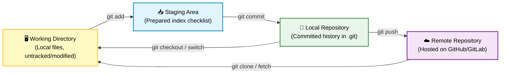
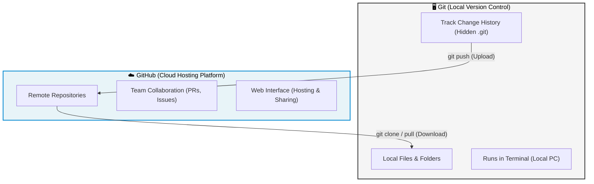

# 📘 Git & GitHub — Complete Course Notes Study Guide

> Welcome to the complete static repository for **Git & GitHub learning notes**. This course index compiles step-by-step notes structured sequentially to guide learners from **absolute beginner (0) to advanced user (100)**. 
> All modules are compiled as standalone, highly-formatted **PDF guides** directly accessible below.

---

## 📂 Sequential PDF Guides Index

These files are designed to be read in order, with each guide building on top of the concepts in the previous one:

| # | PDF Guide Link | Main Focus | Core Topics Covered |
|---|----------------|------------|---------------------|
| **1** | [01_Introduction_and_Core_Concepts.pdf](file:///c:/Users/mibni/OneDrive/Desktop/GIT%20AND%20GITHUB/Git_and_GitHub_Complete_Notes/01_Introduction_and_Core_Concepts.pdf) | Git Fundamentals | What is Git/VCS, Git vs GitHub, Git Local vs Remote architecture, The Four Stages. |
| **2** | [02_Setup_and_Initialization.pdf](file:///c:/Users/mibni/OneDrive/Desktop/GIT%20AND%20GITHUB/Git_and_GitHub_Complete_Notes/02_Setup_and_Initialization.pdf) | Environment Setup | Installation, terminals, configuring identities (`git config`), `git init` internals, and `git clone`. |
| **3** | [03_Basic_Git_Workflow.pdf](file:///c:/Users/mibni/OneDrive/Desktop/GIT%20AND%20GITHUB/Git_and_GitHub_Complete_Notes/03_Basic_Git_Workflow.pdf) | Daily Operations | Tracking changes (`status`), staging (`add`), saving (`commit`), history logs (`log`), deleting (`rm`), and undoing (`reset`). |
| **4** | [04_Branching_and_Merging.pdf](file:///c:/Users/mibni/OneDrive/Desktop/GIT%20AND%20GITHUB/Git_and_GitHub_Complete_Notes/04_Branching_and_Merging.pdf) | Parallel Development | Isolation, branches checkout/switch, Fast-Forward vs 3-Way merging, resolving conflict markers. |
| **5** | [05_Advanced_Git_Features.pdf](file:///c:/Users/mibni/OneDrive/Desktop/GIT%20AND%20GITHUB/Git_and_GitHub_Complete_Notes/05_Advanced_Git_Features.pdf) | History & Utilities | Stashing stack (`git stash`), Rebasing (`rebase`), recovering files with `git reflog`, line diff checks (`git diff`), release tags (`git tag`). |
| **6** | [06_GitHub_and_Collaboration.pdf](file:///c:/Users/mibni/OneDrive/Desktop/GIT%20AND%20GITHUB/Git_and_GitHub_Complete_Notes/06_GitHub_and_Collaboration.pdf) | Remote & Teamwork | Remotes, Pull Requests, forking, `.gitignore` patterns, SSH authentication. |
| **7** | [07_Git_and_GitHub_Cheat_Sheet.pdf](file:///c:/Users/mibni/OneDrive/Desktop/GIT%20AND%20GITHUB/Git_and_GitHub_Complete_Notes/07_Git_and_GitHub_Cheat_Sheet.pdf) | Command Reference | Complete syntax reference table grouped by action category. |
| **★** | [Git_and_GitHub_Complete_Notes.pdf](file:///c:/Users/mibni/OneDrive/Desktop/GIT%20AND%20GITHUB/Git_and_GitHub_Complete_Notes/Git_and_GitHub_Complete_Notes.pdf) | Combined Guide | The entire course note modules compiled together with cover page. |

---

## 🎨 Interactive Architecture Visualizations

This repository uses **theme-adaptive Mermaid charts** to display concept structures instead of dark images or terminal text art, making it easy to read in any theme setting:

### The Four Git Stages Flow


### Git vs GitHub Relationship


---

## 📝 Comprehensive Course Notes Summary

### 🔍 Module 1: Introduction & Core Concepts
* **Version Control (VCS)**: The practice of tracking and managing changes to software code. Allows rolling back to any state, viewing differences, and tracking authors.
* **Git vs GitHub**: Git is the local version control software; GitHub is a cloud-based web service that hosts Git repositories for backup and teamwork.
* **The 4 Stages**:
  1. *Working Directory*: Files currently being edited (untracked/modified).
  2. *Staging Area (Index)*: A checklist containing changes ready to be committed.
  3. *Local Repository*: Secure historical database inside the hidden `.git` folder.
  4. *Remote Repository*: Copy hosted online (e.g. GitHub).

---

### 💻 Module 2: Setup & Initialization
* **Installation & Config**: Once installed, user identity must be set globally:
  ```bash
  git config --global user.name "Your Name"
  git config --global user.email "your.email@example.com"
  ```
* **Git Repositories**: Can be created in two ways:
  1. *Local Init*: Initialize a fresh local repo inside any directory:
     ```bash
     git init
     ```
     *Internal Action*: Creates a hidden `.git/` folder containing directories like `objects/` (database), `refs/` (branches), and files like `HEAD` (active branch pointer).
  2. *Clone Remote*: Download an online repo and link remote connections:
     ```bash
     git clone <repository-url>
     ```

---

### 📥 Module 3: Basic Git Workflow
The circular daily work cycle follows these steps:
1. **Analyze Changes**: Check modified/untracked files:
   ```bash
   git status
   ```
2. **Stage Changes**: Move files to staging. Git packages files into compression blobs inside `.git/objects/` and updates the index file.
   * `git add <file>` (Stage specific file)
   * `git add .` (Stage all changes in current directory & subdirs)
   * `git add -A` (Stage all project changes, including deleted files)
3. **Commit Changes**: Permanently record staged state into history:
   ```bash
   git commit -m "Description of changes"
   ```
   *Internal Action*: Git creates a *tree object* mapping the index structure and a *commit object* mapping tree hash, author, and parent history pointers.
4. **Remove Files**: Delete files from folder and stage in one command:
   ```bash
   git rm <file>          # Deletes from disk and stages deletion
   git rm --cached <file> # Untracks file but leaves it on local disk
   ```

---

### 🌿 Module 4: Branching & Merging
* **Branches**: Independent development lines split from the `main` timeline.
  * Create: `git branch <name>`
  * Switch: `git switch <name>` (or older `git checkout <name>`)
  * Create & Switch: `git switch -c <name>` (or `git checkout -b <name>`)
* **Merging**: Combining changes from one branch into another:
  ```bash
  git switch main
  git merge development
  ```
  * *Fast-Forward Merge*: No commits on destination since split; pointer moves forward.
  * *Three-Way Merge*: Both branches changed; Git creates a new *merge commit*.
* **Merge Conflicts**: Occur when two branches modify the same line. Git inserts conflict markers:
  ```
  <<<<<<< HEAD
  My main branch edits
  =======
  Incoming branch edits
  >>>>>>> development
  ```
  *Resolve*: Edit file to remove markers, keep desired content, then run `git add .` and `git commit`.

---

### ⚡ Module 5: Advanced Git Features
* **Stashing**: Temporarily save unfinished changes to switch branches without committing:
  * `git stash` (Save changes)
  * `git stash list` (View stashes)
  * `git stash pop` (Restore and delete most recent stash)
* **Rebasing**: Replays commits from a feature branch on top of another branch for a clean, linear history.
  ```bash
  git switch feature
  git rebase main
  ```
  *⚠️ Golden Rule*: Never rebase commits that have already been pushed to public/shared remotes.
* **HEAD Recovery**: If you delete a branch or perform a `--hard` reset, Git logs all pointer movements. You can recover lost commits:
  ```bash
  git reflog
  git reset --hard <commit-hash-from-reflog>
  ```

---

### 👥 Module 6: GitHub & Collaboration
* **Remotes**: Linked remote paths named `origin` pointing to the cloud:
  * Add remote: `git remote add origin <url>`
  * Pull & Merge remote branch: `git pull origin main`
  * Upload commits: `git push origin main`
* **Forking & PRs**: 
  1. *Fork*: Creates a copy of an upstream repository under your GitHub profile.
  2. *Branch & Edit*: Code improvements on a feature branch.
  3. *Pull Request (PR)*: Propose merging changes from your fork back to the upstream repo.
* **Excluding Files**: Create a `.gitignore` file in the root to ignore files like `.env`, `node_modules/`, and logs.

---

### 📖 Module 7: Command Cheat Sheet Quick Reference

| Command | Category | Description |
|---------|----------|-------------|
| `git config --list` | Config | View all config configurations. |
| `git init` | Init | Initialize empty local repository. |
| `git clone <url>` | Init | Clone remote repository. |
| `git status` | Workflow | Show state of working directory and index. |
| `git diff` | Workflow | View difference in modified files. |
| `git add .` | Workflow | Stage all local modifications. |
| `git commit -m "msg"` | Workflow | Save staged files to local repository history. |
| `git log --oneline` | History | Show concise history timeline. |
| `git checkout -b <name>`| Branching | Create and switch to new branch. |
| `git merge <branch>` | Branching | Merge branch changes into current HEAD. |
| `git stash` | Advanced | Stash workspace changes. |
| `git rebase <branch>` | Advanced | Reapply commits on top of another branch. |
| `git push` | Remote | Upload local commits to remote repository. |
| `git pull` | Remote | Download and merge remote updates. |

---

## 🎓 Tips for Success

1. **Follow the sequence**: Open the PDFs starting from **Module 1** through **Module 7**.
2. **Practice locally**: Create test folders and practice commands in Git Bash or Terminal.
3. **Use the Cheat Sheet**: Open **Module 7** PDF side-by-side while executing Git workflows for reference.
