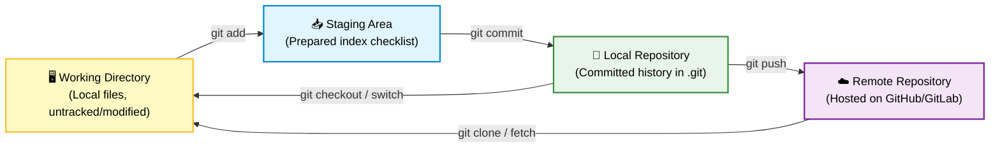
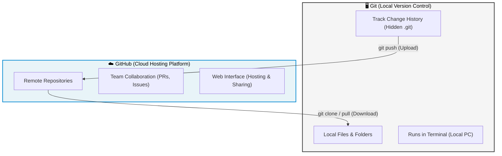
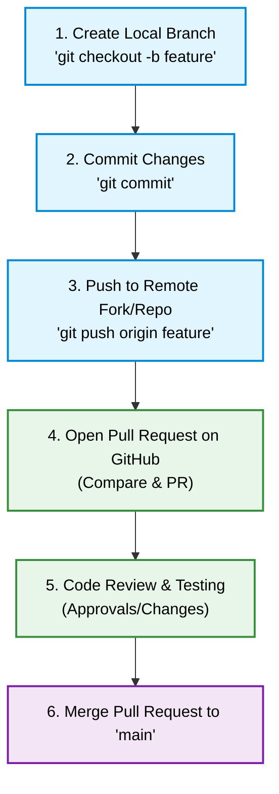

# 📘 Git & GitHub — Complete Course Guide (0 to 100)

> A structured, comprehensive set of notes and guides covering Git version control and GitHub collaboration — from absolute basics to advanced workflows. This repository is designed to help anyone master Git from scratch.

---

## 🗺️ Repository Structure

This repository is split into two main sections for study and reference:

* **📁 [GIT AND GITHUB NOTES](GIT%20AND%20GITHUB%20NOTES)**: Contains the raw Markdown (`.md`) files for all learning modules. Perfect for reading in code editors or previewing online.
* **📁 [Git_and_GitHub_Complete_Notes](Git_and_GitHub_Complete_Notes)**: Contains pre-compiled, highly-formatted **PDF guides** for each module, including a combined single-file course guide. Ideal for printing, sharing, or offline reading.

---

## 📚 Modules Outline

| Module | Link (Markdown) | Link (PDF) | Core Topics Covered |
|--------|-----------------|------------|---------------------|
| **1: Intro & Concepts** | [01_intro_and_concepts.md](GIT%20AND%20GITHUB%20NOTES/modules/01_intro_and_concepts.md) | [01_Introduction_and_Core_Concepts.pdf](Git_and_GitHub_Complete_Notes/01_Introduction_and_Core_Concepts.pdf) | VCS principles, Git vs GitHub comparison, Git Local vs Remote architecture, and the Four Stages. |
| **2: Setup & Init** | [02_setup_and_init.md](GIT%20AND%20GITHUB%20NOTES/modules/02_setup_and_init.md) | [02_Setup_and_Initialization.pdf](Git_and_GitHub_Complete_Notes/02_Setup_and_Initialization.pdf) | Installation, configurations, identity setups (`git config`), local repositories (`git init`), and `git clone`. |
| **3: Basic Workflow** | [03_basic_workflow.md](GIT%20AND%20GITHUB%20NOTES/modules/03_basic_workflow.md) | [03_Basic_Git_Workflow.pdf](Git_and_GitHub_Complete_Notes/03_Basic_Git_Workflow.pdf) | Daily lifecycle commands (`status`, `add`, `commit`), history logs (`log`), deleting (`rm`), and unstaging (`reset`). |
| **4: Branching & Merging** | [04_branching_merging.md](GIT%20AND%20GITHUB%20NOTES/modules/04_branching_merging.md) | [04_Branching_and_Merging.pdf](Git_and_GitHub_Complete_Notes/04_Branching_and_Merging.pdf) | Parallel lines of development, checkout/switch, Fast-Forward vs 3-Way merges, conflict resolution. |
| **5: Advanced Git** | [05_advanced_git.md](GIT%20AND%20GITHUB%20NOTES/modules/05_advanced_git.md) | [05_Advanced_Git_Features.pdf](Git_and_GitHub_Complete_Notes/05_Advanced_Git_Features.pdf) | Workspace stashing (`stash`), Rebasing (`rebase`), HEAD movements (`reflog`), difference checks (`diff`), release tags (`tag`). |
| **6: Collaboration** | [06_github_collaboration.md](GIT%20AND%20GITHUB%20NOTES/modules/06_github_collaboration.md) | [06_GitHub_and_Collaboration.pdf](Git_and_GitHub_Complete_Notes/06_GitHub_and_Collaboration.pdf) | Cloud paths (`remote`), Pull Requests (PRs), repository forking, ignore rules (`.gitignore`), SSH key configs. |
| **7: Cheat Sheet** | [07_cheat_sheet.md](GIT%20AND%20GITHUB%20NOTES/modules/07_cheat_sheet.md) | [07_Git_and_GitHub_Cheat_Sheet.pdf](Git_and_GitHub_Complete_Notes/07_Git_and_GitHub_Cheat_Sheet.pdf) | Organized reference index of all critical command definitions. |
| **Combined Guide** | — | [Git_and_GitHub_Complete_Notes.pdf](Git_and_GitHub_Complete_Notes/Git_and_GitHub_Complete_Notes.pdf) | The entire course note modules compiled into one document. |

---

## 🎨 visual Core Concept Diagrams

These notes use native **Mermaid diagrams** that automatically scale and adapt to GitHub's light or dark mode theme environments:

### The 4 Stages of Git Architecture
Shows how files transition across local and remote environments:

### Git vs GitHub Relationship

### Pull Request Lifecycle

---

## ⚡ Quick Reference Commands Cheat Sheet

| Command | Action | Description |
|---------|--------|-------------|
| `git init` | Workspace Setup | Initialize a new local Git repository in the current folder. |
| `git clone <url>` | Workspace Setup | Clone (download) an existing remote repository. |
| `git status` | Track Status | Show changed, staged, and untracked files. |
| `git add .` | Track Status | Stage all changes in the current directory and its subdirectories. |
| `git commit -m "msg"` | Save Changes | Commit staged changes to history with a message. |
| `git branch <name>` | Branching | Create a new branch. |
| `git switch <name>` | Branching | Switch to an existing branch (modern syntax). |
| `git merge <branch>` | Branching | Merge a branch's changes into the current branch. |
| `git push -u origin main`| Cloud Remote | Push local commits to remote repository and set the default upstream branch. |
| `git pull` | Cloud Remote | Fetch and merge changes from the remote server. |
| `git stash` | History Utilities| Save uncommitted changes temporarily to get a clean working directory. |
| `git log --oneline` | History Utilities| Show history in a clean, single-line format. |

---

## 📖 How to Use This Repository

1. **New to Version Control?** Start with the **Module 1** guide ([Intro & Core Concepts](GIT%20AND%20GITHUB%20NOTES/modules/01_intro_and_concepts.md)) to understand local repositories and version stages.
2. **Follow in order**: Read through the folders sequentially (Module 1 ➔ Module 7).
3. **Use Cheat Sheets**: Keep the **Module 7 Cheat Sheet** open while practicing Git in your terminal.
